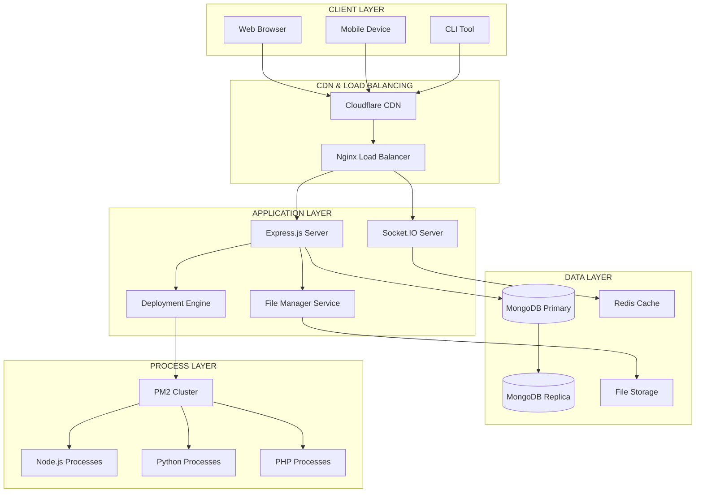
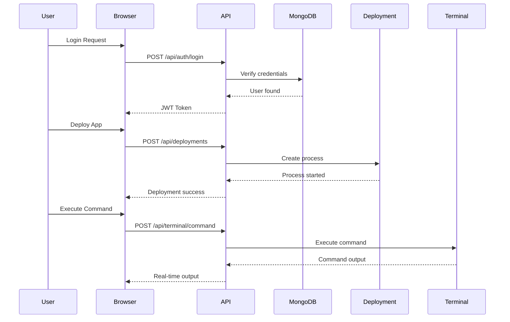
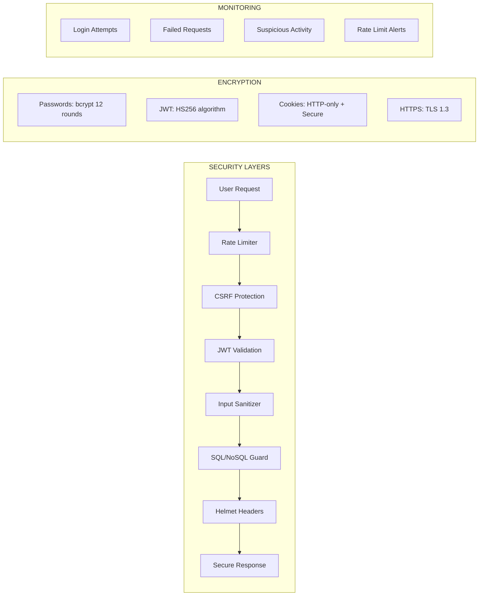

# 🚀 AWAIS CYBER VPS

<div align="center">


## *Powerful Cloud Hosting For Developers, Businesses & Creators*

<br>

```diff
+ ⚡ INSTANT DEPLOYMENT  •  🔒 ENTERPRISE SECURITY  •  🌍 GLOBAL INFRASTRUCTURE  •  💡 DEVELOPER FIRST
```

</div>

<br>

<div align="center">

[](https://github.com/awaiscybergang/AWAIS-CYBER-VPS)
[](https://github.com/awaiscybergang/AWAIS-CYBER-VPS)
[](https://github.com/awaiscybergang/AWAIS-CYBER-VPS)

</div>

<br>

<!-- Animated Typing Effect -->
<div align="center">

```mermaid
━━━━━━━━━━━━━━━━━━━━━━━━━━━━━━━━━━━━━━━━━━━━━━━━━━━━━━━━━━━━━━━━━━━━━━━━━━━━━
💻 DEPLOY WEBSITES    🔌 DEPLOY APIS    🤖 DEPLOY BOTS    🗄️ DEPLOY DATABASES    
━━━━━━━━━━━━━━━━━━━━━━━━━━━━━━━━━━━━━━━━━━━━━━━━━━━━━━━━━━━━━━━━━━━━━━━━━━━━━
```

</div>

---

## 📊 PREMIUM BADGES

<div align="center">

### 🏢 TECHNOLOGY STACK

| Category | Badges |
|----------|--------|
| **Runtime** |   |
| **Framework** |   |
| **Database** |   |
| **Frontend** |    |
| **Security** |    |
| **DevOps** |    |
| **Testing** |   |

### 📈 REPOSITORY STATISTICS

| Metric | Status |
|--------|--------|
| **Stars** | [](https://github.com/awaiscybergang/AWAIS-CYBER-VPS) |
| **Forks** | [](https://github.com/awaiscybergang/AWAIS-CYBER-VPS) |
| **Watchers** | [](https://github.com/awaiscybergang/AWAIS-CYBER-VPS) |
| **Issues** | [](https://github.com/awaiscybergang/AWAIS-CYBER-VPS) |
| **Pull Requests** | [](https://github.com/awaiscybergang/AWAIS-CYBER-VPS) |
| **Contributors** | [](https://github.com/awaiscybergang/AWAIS-CYBER-VPS) |
| **License** | [](https://opensource.org/licenses/MIT) |
| **Version** | [](https://github.com/awaiscybergang/AWAIS-CYBER-VPS) |

</div>

---

## 🤖 MEET THE AWAIS CYBER AI ENGINEER

<div align="center">


### *A futuristic cyber-security inspired AI robot mascot representing innovation, automation, reliability and modern cloud infrastructure*

</div>

<div align="center">

| Responsibility | Description |
|----------------|-------------|
| 🛡️ **Infrastructure Guardian** | Monitors server health and system stability 24/7 |
| 🚀 **Deployment Orchestrator** | Manages application deployments across the platform |
| 🔒 **Security Sentinel** | Protects servers from threats and unauthorized access |
| ⚡ **Performance Optimizer** | Ensures optimal resource utilization and speed |
| 💡 **Cloud Innovator** | Powers cutting-edge cloud hosting features |

</div>

<br>

> *"I am the silent guardian of your infrastructure, working tirelessly to ensure your applications run flawlessly. Every deployment, every request, every database query passes through my watchful circuits. Welcome to the future of cloud hosting."*
> 
> **— AWAIS CYBER AI ENGINEER**

---

## 📖 PROJECT OVERVIEW

<div align="center">

### *Enterprise-Grade VPS Control Panel for the Modern Era*

</div>

**AWAIS CYBER VPS** is a **production-ready, feature-rich hosting control panel** that transforms complex server management into an intuitive, powerful experience. Built for developers who demand control and businesses who need reliability.

### 🎯 What Makes AWAIS CYBER VPS Different?

| Aspect | Traditional Hosting | AWAIS CYBER VPS |
|--------|---------------------|-----------------|
| **Control** | Limited cPanel access | Full root-like control via terminal |
| **Deployment** | Manual configuration | One-click application deployment |
| **Monitoring** | Basic statistics | Real-time metrics with live charts |
| **Security** | Standard measures | Enterprise-grade protection |
| **Cost** | Expensive managed solutions | Open-source & self-hostable |
| **Flexibility** | Locked ecosystems | Deploy anything, anywhere |

### 👥 Who Is This For?

```yaml
Developers:
  - Need complete control over their hosting environment
  - Want to deploy multiple application types
  - Require terminal access and file management
  - Value open-source transparency

Businesses:
  - Seeking cost-effective hosting solutions
  - Need reliable infrastructure for client projects
  - Want to avoid vendor lock-in
  - Require white-label capable systems

DevOps Engineers:
  - Building internal hosting platforms
  - Need automation-ready systems
  - Want API-driven infrastructure
  - Value extensibility and customization

Creators:
  - Hosting portfolios and projects
  - Building communities and tools
  - Experimenting with new technologies
  - Learning server management
```

### 🔥 Problems This Solves

```diff
- ❌ Paying expensive managed hosting fees
- ❌ Struggling with complex server configurations
- ❌ Managing multiple tools for different tasks
- ❌ Limited control over your infrastructure
- ❌ Security concerns with shared hosting
- ❌ Slow deployment processes
- ❌ Poor monitoring capabilities

+ ✅ Complete infrastructure control at zero software cost
+ ✅ Unified platform for all hosting needs
+ ✅ Enterprise security features built-in
+ ✅ Real-time monitoring and alerts
+ ✅ Instant deployment capabilities
+ ✅ Open-source & fully customizable
```

---

## ✨ FEATURES

<div align="center">

### *A Complete Cloud Infrastructure Platform*

</div>

<table>
<tr>
<td width="50%">

### 🚀 **Deployment Engine**
- Node.js applications
- Python web apps
- PHP projects
- Static websites
- REST APIs
- Discord/Telegram bots
- Auto-start management
- Environment variables

</td>
<td width="50%">

### 📁 **Advanced File Manager**
- Upload files (ZIP supported)
- Create/edit/delete files
- Folder management
- Rename/move/copy
- ZIP extraction
- Code editor
- Permission management
- Search functionality

</td>
</tr>
<tr>
<td width="50%">

### 🗄️ **Database Management**
- MongoDB databases
- MySQL databases
- PostgreSQL databases
- Redis cache
- Backup/restore
- Import/export
- Connection strings
- User management

</td>
<td width="50%">

### 🌐 **Domain Control**
- Custom domains
- Subdomain creation
- SSL certificates
- DNS verification
- Auto-renewal
- Domain forwarding
- Wildcard support
- Let's Encrypt integration

</td>
</tr>
<tr>
<td width="50%">

### 💻 **Browser Terminal**
- Full command execution
- Live output streaming
- Process monitoring
- Service management
- File operations
- Git commands
- Package installation
- Root-like access

</td>
<td width="50%">

### 📊 **Real-time Monitoring**
- CPU usage charts
- RAM consumption
- Storage analytics
- Network bandwidth
- Active processes
- Service health
- Uptime tracking
- Custom alerts

</td>
</tr>
<tr>
<td width="50%">

### 🔐 **Authentication System**
- JWT tokens
- Email verification
- Password reset
- Session management
- Role-based access
- API key support
- 2FA ready
- Activity logging

</td>
<td width="50%">

### 🛡️ **Security Layer**
- Helmet.js protection
- Rate limiting
- CSRF tokens
- XSS prevention
- SQL injection protection
- Secure cookies
- Input validation
- Error sanitization

</td>
</tr>
</table>

---

## 🏗️ ARCHITECTURE

<div align="center">

### *Enterprise Infrastructure Design*

</div>



<div align="center">

### *Data Flow Diagram*

</div>



---

## 🛠️ COMPLETE TECH STACK

<div align="center">

### *Battle-Tested Technologies Powering AWAIS CYBER VPS*

</div>

<table>
<thead>
<tr>
<th colspan="3">🚀 BACKEND TECHNOLOGIES</th>
</tr>
</thead>
<tbody>
<tr>
<td>

**Runtime Environment**
- Node.js 18.x LTS
- npm 9.x
- PM2 5.3

</td>
<td>

**Web Framework**
- Express.js 4.18
- Socket.IO 4.5
- CORS enabled

</td>
<td>

**Authentication**
- JWT (JSON Web Tokens)
- bcryptjs 2.4
- express-session

</td>
</tr>
<tr>
<td>

**Database ORM**
- Mongoose 8.0
- MongoDB Driver
- Connection pooling

</td>
<td>

**File Operations**
- Multer 1.4
- Adm-Zip 0.5
- fs-extra 11.1

</td>
<td>

**Security**
- Helmet 7.1
- express-rate-limit
- express-validator

</td>
</tr>
</tbody>
</table>

<table>
<thead>
<tr>
<th colspan="3">🎨 FRONTEND TECHNOLOGIES</th>
</tr>
</thead>
<tbody>
<tr>
<td>

**Core Technologies**
- HTML5
- CSS3
- JavaScript ES6+

</td>
<td>

**UI/UX Features**
- Glassmorphism design
- Cyberpunk theme
- Responsive layout

</td>
<td>

**Data Visualization**
- Chart.js 4.4
- Real-time charts
- Interactive graphs

</td>
</tr>
</tbody>
</table>

<table>
<thead>
<tr>
<th colspan="3">🖥️ INFRASTRUCTURE & DEVOPS</th>
</tr>
</thead>
<tbody>
<tr>
<td>

**Web Server**
- Nginx 1.24
- Reverse proxy
- Load balancing

</td>
<td>

**Process Management**
- PM2 cluster mode
- Auto-restart
- Log management

</td>
<td>

**Containerization**
- Docker ready
- Docker Compose
- Image optimization

</td>
</tr>
<tr>
<td>

**Monitoring**
- PM2 monit
- Systeminformation
- Custom metrics

</td>
<td>

**Backup Solutions**
- mongodump
- cron jobs
- Automated backups

</td>
<td>

**SSL/TLS**
- Let's Encrypt
- Auto-renewal
- HTTPS enforcement

</td>
</tr>
</tbody>
</table>

---

## 🎨 VISUAL SHOWCASE

<div align="center">

### *Experience The Interface*

</div>

### 📊 Dashboard Analytics

<div align="center">


*Real-time resource monitoring with live charts and instant alerts*

| Widget | Live Data | Update Frequency |
|--------|-----------|------------------|
| CPU Monitor | Real-time usage % | Every 2 seconds |
| RAM Monitor | Used/Total in GB | Every 2 seconds |
| Storage Monitor | Disk space analytics | Every 5 seconds |
| Network Monitor | RX/TX bandwidth | Every 5 seconds |

</div>

### 🚀 Deployment Manager

<div align="center">


*One-click deployment for all application types*

```yaml
Supported Applications:
  ✅ Node.js (Express, Nest, Koa)
  ✅ Python (Django, Flask, FastAPI)
  ✅ PHP (Laravel, Symfony, WordPress)
  ✅ Static Sites (React, Vue, Angular)
  ✅ REST APIs (Any framework)
  ✅ Bots (Discord, Telegram, Slack)
```

</div>

### 📁 Advanced File Manager

<div align="center">


*Complete file operations with modern interface*

```diff
+ Upload files via drag-and-drop
+ Create folders and organize
+ Edit code in built-in editor
+ Extract ZIP archives
+ Search files by name
+ Preview images and text
+ Download files or folders
+ Set file permissions
```

</div>

### 💻 Browser Terminal

<div align="center">


*Full Linux command-line access from your browser*

```bash
$ whoami
awais-cyber-user

$ uptime
  up 7 days, 14 hours, 32 minutes

$ pm2 list
┌─────┬──────────┬─────────┬─────────┬─────────┐
│ id  │ name     │ status  │ cpu     │ memory  │
├─────┼──────────┼─────────┼─────────┼─────────┤
│ 0   │ my-app   │ online  │ 2.5%    │ 128MB   │
└─────┴──────────┴─────────┴─────────┴─────────┘
```

</div>

### 📈 Monitoring Center

<div align="center">


*Enterprise-grade infrastructure monitoring*

```yaml
Real-time Metrics:
  🖥️ CPU: ████████░░░░ 45% (2.5/5.5 GHz)
  💾 RAM: ██████░░░░░░ 42% (2.1/5.0 GB)
  💽 Disk: ██████████░░ 67% (33.5/50 GB)
  🌐 Network: 125 KB/s ↓  85 KB/s ↑
  
Active Connections: 47
Running Processes: 128
Database Queries: 12.5k/min
```

</div>

---

## 🔒 ENTERPRISE SECURITY

<div align="center">

### *Zero-Trust Security Architecture*

</div>



### 🛡️ Security Features Matrix

| Security Layer | Implementation | Protection Level |
|----------------|----------------|------------------|
| **Authentication** | JWT with refresh tokens | 🔒 Enterprise |
| **Password Storage** | bcrypt (12 rounds) | 🔒 Military-grade |
| **Session Management** | HTTP-only secure cookies | 🔒 Advanced |
| **Rate Limiting** | 100 req/15min per IP | 🔒 DDoS Protection |
| **CSRF Protection** | Token-based validation | 🔒 Web Attacks |
| **XSS Prevention** | CSP headers + sanitization | 🔒 Script Injection |
| **SQL Injection** | Parameterized queries/ODM | 🔒 Database |
| **Input Validation** | Express-validator schemas | 🔒 Data Integrity |
| **Headers Security** | Helmet.js full suite | 🔒 Information Leak |
| **File Upload** | Type/size validation | 🔒 Malware |

---

## 📂 PROFESSIONAL PROJECT STRUCTURE

```bash
AWAIS-CYBER-VPS/
│
├── 🎯 backend/                          # Core backend services
│   ├── 🧠 controllers/                  # Business logic (15 files)
│   │   ├── authController.js           # Authentication & sessions
│   │   ├── userController.js           # User management
│   │   ├── deploymentController.js     # Deployment orchestration
│   │   ├── databaseController.js       # Database operations
│   │   ├── domainController.js         # Domain management
│   │   ├── fileController.js           # File system operations
│   │   ├── terminalController.js       # Command execution
│   │   ├── monitoringController.js     # System monitoring
│   │   ├── analyticsController.js      # Analytics engine
│   │   └── adminController.js          # Administrative functions
│   │
│   ├── 📊 models/                       # MongoDB schemas (8 models)
│   │   ├── User.js                     # User schema
│   │   ├── Deployment.js               # Deployment schema
│   │   ├── Database.js                 # Database schema
│   │   ├── Domain.js                   # Domain schema
│   │   ├── Subdomain.js                # Subdomain schema
│   │   ├── Server.js                   # Server schema
│   │   ├── Log.js                      # Logging schema
│   │   └── Analytics.js                # Analytics schema
│   │
│   ├── 🛣️ routes/                       # API endpoints (11 files)
│   │   ├── auth.js                     # Auth routes
│   │   ├── users.js                    # User routes
│   │   ├── deployments.js              # Deployment routes
│   │   ├── databases.js                # Database routes
│   │   ├── domains.js                  # Domain routes
│   │   ├── subdomains.js               # Subdomain routes
│   │   ├── files.js                    # File manager routes
│   │   ├── terminal.js                 # Terminal routes
│   │   ├── monitoring.js               # Monitoring routes
│   │   ├── analytics.js                # Analytics routes
│   │   └── admin.js                    # Admin routes
│   │
│   ├── 🛡️ middleware/                   # Security & validation (7 files)
│   │   ├── auth.js                     # JWT verification
│   │   ├── rateLimit.js                # Rate limiting
│   │   ├── validation.js               # Input validation
│   │   ├── security.js                 # Security headers
│   │   ├── csrf.js                     # CSRF protection
│   │   ├── errorHandler.js             # Error handling
│   │   └── upload.js                   # File upload handling
│   │
│   ├── 🔧 services/                     # Business services (4 files)
│   │   ├── emailService.js             # Email delivery
│   │   ├── backupService.js            # Backup automation
│   │   ├── monitoringService.js        # System monitoring
│   │   └── deploymentService.js        # Deployment engine
│   │
│   ├── 🛠️ utils/                        # Helper utilities
│   │   ├── helpers.js                  # Helper functions
│   │   ├── constants.js                # Application constants
│   │   └── validators.js               # Validation rules
│   │
│   └── 🚀 server.js                     # Express application entry
│
├── 🎨 frontend/                         # Frontend source code
│   ├── 🎭 css/                          # Stylesheets (4 files)
│   │   ├── style.css                   # Main styles
│   │   ├── dashboard.css               # Dashboard styles
│   │   ├── terminal.css                # Terminal styles
│   │   └── responsive.css              # Responsive design
│   │
│   ├── ⚡ js/                           # JavaScript modules (12 files)
│   │   ├── app.js                      # Main application
│   │   ├── auth.js                     # Authentication
│   │   ├── dashboard.js                # Dashboard logic
│   │   ├── deployments.js              # Deployment logic
│   │   ├── fileManager.js              # File manager
│   │   ├── database.js                 # Database logic
│   │   ├── domain.js                   # Domain logic
│   │   ├── terminal.js                 # Terminal logic
│   │   ├── monitoring.js               # Monitoring logic
│   │   ├── analytics.js                # Analytics logic
│   │   └── admin.js                    # Admin panel
│   │
│   ├── 📄 pages/                        # HTML pages (10 pages)
│   │   ├── dashboard.html
│   │   ├── deployments.html
│   │   ├── file-manager.html
│   │   ├── databases.html
│   │   ├── domains.html
│   │   ├── terminal.html
│   │   ├── logs.html
│   │   ├── analytics.html
│   │   ├── settings.html
│   │   └── admin.html
│   │
│   └── 🏠 index.html                    # Main entry point
│
├── 📁 uploads/                          # User uploaded files
├── 🚀 deployments/                      # Deployed applications
├── 💾 backups/                          # Database backups
├── 📝 logs/                             # System logs
├── 🌐 public/                           # Static assets
├── 📚 docs/                             # Documentation
│   └── 🖼️ images/                       # Screenshots & assets
│       ├── dashboard.png
│       ├── deployments.png
│       ├── file-manager.png
│       ├── terminal.png
│       ├── monitoring.png
│       └── awais-cyber-robot.gif
│
├── ⚙️ config/                           # Configuration files
├── 🔐 .env                              # Environment variables
├── 📦 package.json                      # NPM dependencies
├── 🐳 Dockerfile                        # Docker configuration
├── 🌍 nginx.conf                        # Nginx configuration
├── 🚀 pm2.config.js                     # PM2 configuration
└── 📖 README.md                         # Documentation
```

---

## 🚀 INSTALLATION GUIDE

<div align="center">

### *Deploy in Minutes, Not Hours*

</div>

### 📋 Prerequisites

```yaml
Minimum Requirements:
  🖥️ CPU: 2 cores @ 2.0 GHz
  💾 RAM: 2 GB
  💽 Storage: 20 GB SSD
  🐧 OS: Ubuntu 20.04+ / Debian 11+ / CentOS 8+
  🌐 Network: 100 Mbps
  📦 Node.js: 16.0 or higher
  🗄️ MongoDB: 5.0 or higher

Recommended Specifications:
  🖥️ CPU: 4 cores @ 2.5 GHz
  💾 RAM: 4 GB
  💽 Storage: 50 GB SSD
  🐧 OS: Ubuntu 22.04 LTS
  🌐 Network: 1 Gbps
  📦 Node.js: 18.0 or higher
  🗄️ MongoDB: 6.0 or higher
```

### Step 1: Clone Repository

```bash
git clone https://github.com/awaiscybergang/AWAIS-CYBER-VPS.git
cd AWAIS-CYBER-VPS
```

### Step 2: Install Dependencies

```bash
npm install
```

### Step 3: Install & Configure MongoDB

**Ubuntu/Debian:**
```bash
# Import MongoDB GPG key
wget -qO - https://www.mongodb.org/static/pgp/server-6.0.asc | sudo apt-key add -

# Add MongoDB repository
echo "deb [ arch=amd64,arm64 ] https://repo.mongodb.org/apt/ubuntu focal/mongodb-org/6.0 multiverse" | sudo tee /etc/apt/sources.list.d/mongodb-org-6.0.list

# Install MongoDB
sudo apt-get update
sudo apt-get install -y mongodb-org

# Start MongoDB service
sudo systemctl start mongod
sudo systemctl enable mongod

# Verify installation
sudo systemctl status mongod
```

**macOS:**
```bash
brew tap mongodb/brew
brew install mongodb-community@6.0
brew services start mongodb-community
```

**Windows:**
```powershell
# Download installer from:
# https://www.mongodb.com/try/download/community

# Run installer (select Complete setup)
# MongoDB will run as a Windows service
```

### Step 4: Configure Environment Variables

```bash
# Create .env file
cp .env.example .env

# Edit configuration
nano .env
```

**.env Configuration:**
```env
# Server Configuration
PORT=5000
NODE_ENV=production

# Database Connection
MONGODB_URI=mongodb://localhost:27017/awais-cyber-vps

# JWT Security (Generate unique secrets!)
JWT_SECRET=your-unique-jwt-secret-here-change-this
JWT_REFRESH_SECRET=your-unique-refresh-secret-here-change-this

# Session Security
SESSION_SECRET=your-session-secret-here

# Email Configuration (for password reset)
EMAIL_HOST=smtp.gmail.com
EMAIL_PORT=587
EMAIL_USER=your-email@gmail.com
EMAIL_PASS=your-app-password

# Security Settings
CSRF_SECRET=your-csrf-secret
RATE_LIMIT_WINDOW_MS=900000
RATE_LIMIT_MAX=100

# Admin Account (first run only)
ADMIN_EMAIL=admin@awaicyber.com
ADMIN_PASSWORD=Admin@123456

# Frontend URL
FRONTEND_URL=http://localhost:5000
```

### Step 5: Create Required Directories

```bash
mkdir -p uploads deployments backups logs public
chmod 755 uploads deployments backups logs
```

### Step 6: Start the Application

**Development Mode:**
```bash
npm run dev
```

**Production Mode:**
```bash
npm start
```

**With PM2 (Recommended):**
```bash
# Install PM2 globally
npm install -g pm2

# Start application
pm2 start backend/server.js --name awais-cyber-vps

# View status
pm2 status

# Monitor in real-time
pm2 monit

# View logs
pm2 logs awais-cyber-vps

# Save PM2 configuration
pm2 save

# Enable startup on boot
pm2 startup
```

### Step 7: Access the Platform

```bash
# Open your browser and navigate to:
http://localhost:5000

# Login with admin credentials:
Email: admin@awaicyber.com
Password: Admin@123456
```

---

## 🌟 OPEN SOURCE VISION

<div align="center">

### *Democratizing Cloud Infrastructure*

</div>

```diff
+ EVERYONE SHOULD BE ABLE TO RUN THEIR OWN CLOUD
+ EVERY DEVELOPER SHOULD UNDERSTAND HOSTING
+ EVERY BUSINESS SHOULD CONTROL THEIR INFRASTRUCTURE
+ OPEN SOURCE IS THE FUTURE OF CLOUD
```

### 💭 Our Philosophy

**AWAIS CYBER VPS** is built on the belief that **cloud infrastructure should be accessible, transparent, and controllable** by everyone. We're not just building a product; we're creating a movement.

### 🔓 What Open Source Means For You

| Freedom | Benefit |
|---------|---------|
| **Study the Code** | Learn how modern hosting platforms work |
| **Modify Everything** | Customize every aspect for your needs |
| **Self-Host** | Run your own VPS platform, no vendor lock-in |
| **Contribute Back** | Join a community of like-minded developers |
| **Build Your Business** | Use as foundation for your hosting company |
| **No Hidden Costs** | 100% free, forever |

### 🌍 The Bigger Picture

```yaml
Mission:
  Provide enterprise-grade hosting infrastructure
  accessible to every developer, business, and creator
  
Values:
  - Transparency in every line of code
  - Community-driven development
  - Continuous learning and improvement
  - Breaking down hosting barriers
  
Impact:
  - Reduced hosting costs for businesses
  - Learning platform for developers
  - Innovation in open infrastructure
  - Global community building
```

---

## 🗺️ ROADMAP

<div align="center">

### *Building The Future Together*

</div>

### ✅ Completed Features (v1.0.0)

```diff
+ User authentication & authorization system
+ Complete deployment manager (Node.js, Python, PHP, Static)
+ Advanced file manager with full CRUD operations
+ Database management (MongoDB, MySQL, PostgreSQL)
+ Domain & subdomain management system
+ Browser-based terminal with command execution
+ Real-time monitoring with Socket.IO
+ Admin panel with user management
+ Logs system with search and filter
+ Analytics dashboard with charts
+ Glassmorphism cyberpunk UI design
+ Fully responsive layout
+ JWT authentication with refresh tokens
+ Rate limiting & security headers
+ Email verification & password reset
+ File upload with ZIP extraction
+ Process management with PM2
```

### 🔄 In Progress (v1.1.0)

```diff
! Docker container deployment support
! Kubernetes orchestration integration
! Auto-scaling based on resource usage
! Automated backup scheduling system
! Two-Factor Authentication (2FA)
! OAuth integration (GitHub, Google, GitLab)
! Per-user API rate limiting
! Webhook integrations (Discord, Slack, Telegram)
! Mobile application development
! CLI tool for deployment management
```

### 📅 Planned Features (v2.0.0)

```diff
- Serverless functions support
- CDN integration (Cloudflare, AWS CloudFront)
- Load balancing configuration interface
- Database clustering management
- Automated SSL certificate renewal
- Custom email templates
- White-label branding options
- Terraform provider
- Ansible playbooks
- Prometheus metrics export
- Grafana dashboard integration
- Multi-region deployment support
```

---

## 👥 COMMUNITY & CONTRIBUTIONS

<div align="center">

### *Together We Build Better*

</div>

### 🤝 How To Contribute

| Role | Contribution | Impact |
|------|--------------|--------|
| **💻 Developer** | Submit PRs, fix bugs, add features | Direct code improvement |
| **🎨 Designer** | Improve UI/UX, create assets | Better user experience |
| **📝 Writer** | Documentation, tutorials, guides | Clearer communication |
| **🐛 Tester** | Report issues, test features | Higher quality |
| **🗣️ Advocate** | Star repo, share with others | Community growth |
| **💸 Sponsor** | Financial support | Sustainable development |

### 📋 Contribution Workflow

```bash
# 1. Fork the repository
# 2. Clone your fork
git clone https://github.com/YOUR_USERNAME/AWAIS-CYBER-VPS.git

# 3. Create a feature branch
git checkout -b feature/amazing-feature

# 4. Make your changes
# 5. Commit with conventional commits
git commit -m "feat: add amazing feature"

# 6. Push to your fork
git push origin feature/amazing-feature

# 7. Open a Pull Request
```

### 💬 Community Channels

```yaml
Discussions:
  - GitHub Discussions for feature ideas
  - Issue tracker for bug reports
  - Pull requests for code contributions

Communication:
  - Discord: Coming soon
  - Telegram: Coming soon
  - Twitter: @awaiscybergang

Resources:
  - Documentation: In repository
  - Wiki: Contribution guides
  - Examples: Demo applications
```

---

## 📞 SUPPORT & CONTACT

<div align="center">

### *We're Here To Help*

</div>

### 🆘 Getting Support

| Issue Type | Best Channel | Response Time |
|------------|--------------|---------------|
| **🐛 Bug Report** | [GitHub Issues](https://github.com/awaiscybergang/AWAIS-CYBER-VPS/issues) | 24-48 hours |
| **💡 Feature Request** | [GitHub Discussions](https://github.com/awaiscybergang/AWAIS-CYBER-VPS/discussions) | 48-72 hours |
| **📖 Documentation** | [Repository Wiki](https://github.com/awaiscybergang/AWAIS-CYBER-VPS/wiki) | Self-service |
| **🔧 Technical Help** | [Discord/Slack](#) | Coming soon |
| **💼 Business Inquiries** | 📧 [rojxb268@gmail.com](mailto:rojxb268@gmail.com) | 24 hours |

### 📧 Contact Information

<div align="center">

| Platform | Link/Handle |
|----------|-------------|
| **📧 Email** | [rojxb268@gmail.com](mailto:rojxb268@gmail.com) |
| **🐙 GitHub** | [@awaiscybergang](https://github.com/awaiscybergang) |
| **📁 Repository** | [AWAIS-CYBER-VPS](https://github.com/awaiscybergang/AWAIS-CYBER-VPS) |
| **🐦 Twitter** | [@awaiscybergang](#) (Coming Soon) |
| **💬 Discord** | [Coming Soon](#) |
| **📱 Telegram** | [Coming Soon](#) |
| **🔗 LinkedIn** | [Coming Soon](#) |
| **📺 YouTube** | [Coming Soon](#) |
| **📘 Facebook** | [Coming Soon](#) |

</div>

### ⭐ Show Your Support

**If AWAIS CYBER VPS has helped you, please consider:**

```diff
+ Starring the repository
+ Following @awaiscybergang on GitHub
+ Sharing with your network
+ Contributing code or documentation
+ Reporting bugs and suggesting features
+ Sponsoring the project (coming soon)
```

---

## 📄 LICENSE

<div align="center">

### *MIT License - Open Source, Forever*

</div>

```license
MIT License

Copyright (c) 2024-2025 Awais Cyber Gang

Permission is hereby granted, free of charge, to any person obtaining a copy
of this software and associated documentation files (the "Software"), to deal
in the Software without restriction, including without limitation the rights
to use, copy, modify, merge, publish, distribute, sublicense, and/or sell
copies of the Software, and to permit persons to whom the Software is
furnished to do so, subject to the following conditions:

The above copyright notice and this permission notice shall be included in all
copies or substantial portions of the Software.

THE SOFTWARE IS PROVIDED "AS IS", WITHOUT WARRANTY OF ANY KIND, EXPRESS OR
IMPLIED, INCLUDING BUT NOT LIMITED TO THE WARRANTIES OF MERCHANTABILITY,
FITNESS FOR A PARTICULAR PURPOSE AND NONINFRINGEMENT. IN NO EVENT SHALL THE
AUTHORS OR COPYRIGHT HOLDERS BE LIABLE FOR ANY CLAIM, DAMAGES OR OTHER
LIABILITY, WHETHER IN AN ACTION OF CONTRACT, TORT OR OTHERWISE, ARISING FROM,
OUT OF OR IN CONNECTION WITH THE SOFTWARE OR THE USE OR OTHER DEALINGS IN THE
SOFTWARE.
```

### 📋 License Summary

| Action | Permitted |
|--------|-----------|
| **Commercial Use** | ✅ Yes |
| **Modification** | ✅ Yes |
| **Distribution** | ✅ Yes |
| **Private Use** | ✅ Yes |
| **Sublicensing** | ❌ No (same license) |
| **Liability** | ❌ No warranty |
| **Trademark Use** | ❌ Restricted |

---

<div align="center">

## 🚀 AWAIS CYBER VPS

### *Powerful Cloud Hosting For Developers, Businesses & Creators*

---

**Built With Passion, Learning And Continuous Innovation**

---

```diff
+ OPEN SOUSE    •    DEVELOPER FOCUSED    •    INFRASTRUCTURE DRIVEN    •    SECURITY FIRST
```

---

<div align="center">

### 🤖 Built By [Awais Cyber Gang](https://github.com/awaiscybergang)

[](https://github.com/awaiscybergang)
[](https://github.com/awaiscybergang/AWAIS-CYBER-VPS)

</div>

---

### 📈 Repository Activity


---

### 🏆 Visitors Counter


---

**© 2024-2027 Awais Cyber Gang | Building The Future Of Open Infrastructure**

[Back to Top ↑](#-awais-cyber-vps)

</div>

---

*Last Updated: December 2026 | Version 2.0.0 | Open Source Software*
