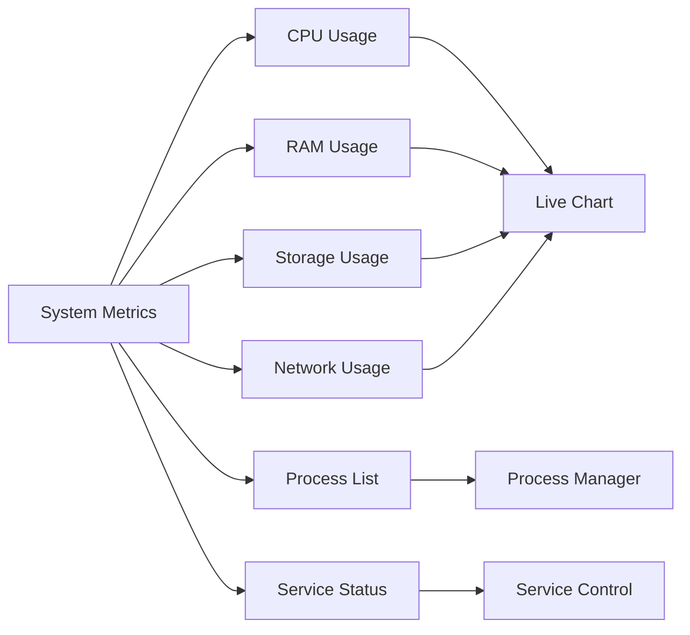

# AWAIS CYBER VPS

<div align="center">


# 🚀 AWAIS CYBER VPS

## Powerful Cloud Hosting For Developers, Businesses & Creators

[](https://github.com/awaiscybergang/AWAIS-CYBER-VPS)
[](https://github.com/awaiscybergang/AWAIS-CYBER-VPS)
[](https://nodejs.org)
[](https://mongodb.com)
[](https://opensource.org/licenses/MIT)

[](https://github.com/awaiscybergang/AWAIS-CYBER-VPS)
[](https://github.com/awaiscybergang/AWAIS-CYBER-VPS)
[](https://github.com/awaiscybergang/AWAIS-CYBER-VPS)

</div>

---

## 📌 Hero Header

<div align="center">

### ⚡ Instant Deployment | 🔒 Enterprise Security | 🌍 Global Infrastructure | 💡 Developer First

**Deploy Websites • Host Bots • Run APIs • Manage Databases • Monitor Servers • Control Everything**

**[🌐 Live Demo](https://github.com/awaiscybergang/AWAIS-CYBER-VPS)** &nbsp;&nbsp;&nbsp; **[📚 Documentation](https://github.com/awaiscybergang/AWAIS-CYBER-VPS)** &nbsp;&nbsp;&nbsp; **[💬 Community](https://github.com/awaiscybergang/AWAIS-CYBER-VPS/issues)**

</div>

---

## 🏆 Premium Badges

<div align="center">

| Category | Badges |
|----------|--------|
| **Technology** |    |
| **Database** |   |
| **Frontend** |    |
| **Security** |    |
| **Deployment** |    |
| **Code Quality** |   |

</div>

---

## 📖 Project Overview

<div align="center">

**AWAIS CYBER VPS** is a **professional, production-ready VPS hosting control panel** that empowers developers, businesses, and creators to deploy and manage applications effortlessly.

</div>

### 🎯 What Makes This Special?

| Aspect | Description |
|--------|-------------|
| **🚀 Instant Deployment** | Deploy Node.js, Python, PHP, and static sites in seconds |
| **🎨 Modern UI** | Glassmorphism cyberpunk design with neon effects |
| **🔒 Enterprise Security** | JWT auth, rate limiting, CSRF protection, XSS prevention |
| **📊 Real-time Monitoring** | Live CPU, RAM, storage, and network metrics with Socket.IO |
| **💻 Browser Terminal** | Full command-line access from your web browser |
| **🗄️ Database Manager** | Create and manage MongoDB, MySQL, PostgreSQL databases |
| **📁 Advanced File Manager** | Upload, edit, delete, zip, unzip files directly |
| **🌐 Domain Management** | Custom domains, subdomains, SSL certificates |

---

## 💭 Why This Project Exists

<div align="center">

### The Problem

Many developers and small businesses struggle with:
- ❌ Complex VPS management interfaces
- ❌ Expensive managed hosting solutions
- ❌ Limited control over their infrastructure
- ❌ No unified platform for all hosting needs

### The Solution

**AWAIS CYBER VPS bridges this gap** by providing:
- ✅ **Simple, intuitive control panel**
- ✅ **Complete infrastructure control**
- ✅ **All-in-one hosting solution**
- ✅ **Enterprise features at affordable cost**
- ✅ **Open source & community driven**

</div>

---

## ✨ Features

<div align="center">

### 🎯 Core Platform Features

</div>

| Category | Features |
|----------|----------|
| **👤 User Management** | JWT Authentication • Email Verification • Password Reset • 2FA Ready • Role-based Access |
| **🚀 Deployment** | Node.js • Python • PHP • Static Sites • REST APIs • Auto-start • Process Management |
| **📁 File Manager** | Upload • Download • Edit • Delete • Rename • Move • Copy • ZIP Extract • Folder Creation |
| **🗄️ Database** | MongoDB • MySQL • PostgreSQL • Redis • Backup • Restore • Import • Export |
| **🌐 Domains** | Custom Domains • Subdomains • SSL Certificates • DNS Management • Auto-renewal |
| **💻 Terminal** | Command Execution • Live Output • Process Monitoring • Service Control • File Operations |
| **📊 Monitoring** | CPU Usage • RAM Usage • Storage • Bandwidth • Network Status • Live Charts |
| **📝 Logs** | Application Logs • Server Logs • Deployment Logs • Error Logs • Search • Filter • Download |
| **📈 Analytics** | Usage Graphs • Performance Metrics • Resource Trends • Deployment Statistics |

---

## 🏗️ Architecture

<div align="center">

```
┌─────────────────────────────────────────────────────────────┐
│                         Client Browser                       │
│                    (React/Vanilla JS Frontend)               │
└─────────────────────────────┬───────────────────────────────┘
                              │
                              ▼
┌─────────────────────────────────────────────────────────────┐
│                      Nginx Reverse Proxy                     │
│                   (SSL Termination + Load Balance)           │
└─────────────────────────────┬───────────────────────────────┘
                              │
                              ▼
┌─────────────────────────────────────────────────────────────┐
│                      Express.js Server                       │
│  ┌──────────┐  ┌──────────┐  ┌──────────┐  ┌──────────┐   │
│  │   Auth   │  │   API    │  │   File   │  │ Terminal │   │
│  │   Layer  │  │  Routes  │  │   Ops    │  │   Shell  │   │
│  └──────────┘  └──────────┘  └──────────┘  └──────────┘   │
└─────────────┬───────────────┬───────────────┬───────────────┘
              │               │               │
              ▼               ▼               ▼
┌─────────────────┐  ┌─────────────┐  ┌─────────────────┐
│    MongoDB      │  │  File System│  │   Redis Cache   │
│   (Database)    │  │ (Deployments)│  │   (Session)     │
└─────────────────┘  └─────────────┘  └─────────────────┘

            Socket.IO for Real-time Communication
```

</div>

---

## 🛠️ Tech Stack

<div align="center">

### Backend Technologies

| Technology | Version | Purpose |
|------------|---------|---------|
| **Node.js** | 18.x | JavaScript Runtime |
| **Express.js** | 4.18 | Web Framework |
| **MongoDB** | 6.0 | Primary Database |
| **Mongoose** | 8.0 | ODM Library |
| **Socket.IO** | 4.5 | Real-time Communication |
| **JWT** | 9.0 | Authentication |
| **bcryptjs** | 2.4 | Password Hashing |
| **Multer** | 1.4 | File Upload |
| **Adm-Zip** | 0.5 | ZIP Operations |
| **Helmet** | 7.1 | Security Headers |

### Frontend Technologies

| Technology | Purpose |
|------------|---------|
| **HTML5** | Structure |
| **CSS3** | Styling & Animations |
| **Vanilla JS** | Interactivity |
| **Chart.js** | Analytics Charts |
| **Socket.IO Client** | Real-time Updates |
| **Font Awesome** | Icons |

### DevOps & Tools

| Tool | Purpose |
|------|---------|
| **PM2** | Process Management |
| **Nginx** | Reverse Proxy |
| **Git** | Version Control |
| **Docker** | Containerization |
| **Let's Encrypt** | SSL Certificates |

</div>

---

## 📊 Dashboard Features

<div align="center">

### Real-time Monitoring Dashboard

</div>

| Widget | Description | Update Frequency |
|--------|-------------|------------------|
| **CPU Usage** | Real-time processor utilization | 2 seconds |
| **RAM Usage** | Memory consumption analytics | 2 seconds |
| **Storage Usage** | Disk space monitoring | 5 seconds |
| **Network Usage** | Bandwidth in/out tracking | 5 seconds |
| **System Uptime** | Server availability status | 10 seconds |
| **Active Deployments** | Running applications count | Real-time |
| **Recent Logs** | Latest system events | Real-time |
| **Resource Alerts** | Threshold notifications | Real-time |

---

## 🚀 Deployment Features

<div align="center">

### Supported Application Types

</div>

```yaml
Node.js Applications:
  - Express.js APIs
  - Nest.js Applications
  - Discord/Telegram Bots
  - Real-time WebSocket Servers

Python Applications:
  - Django Web Apps
  - Flask APIs
  - Automation Scripts
  - Machine Learning APIs

PHP Applications:
  - Laravel Projects
  - WordPress Sites
  - Custom PHP Apps
  - REST APIs

Static Websites:
  - HTML/CSS/JS Sites
  - React/Vue Builds
  - Documentation Sites
  - Landing Pages

REST APIs:
  - Any Framework
  - GraphQL Servers
  - Webhook Endpoints
```

### Deployment Workflow

```
1. Upload ZIP → 2. Extract Files → 3. Configure Environment → 4. Start Application → 5. Monitor Logs
```

---

## 📁 File Manager Features

<div align="center">

### Complete File Operations

</div>

| Operation | Supported | Description |
|-----------|-----------|-------------|
| **Upload Files** | ✅ | Single/Multiple files up to 100MB |
| **Upload ZIP** | ✅ | Auto-extract or manual extraction |
| **Create Folder** | ✅ | Nested directory structure |
| **Edit Files** | ✅ | Built-in code editor with syntax highlighting |
| **Delete** | ✅ | Single or bulk deletion |
| **Rename** | ✅ | File and folder renaming |
| **Move** | ✅ | Drag-drop or path-based moving |
| **Copy** | ✅ | Duplicate files/folders |
| **Download** | ✅ | Single file or ZIP download |
| **Permissions** | ✅ | CHMOD file permissions |
| **Search** | ✅ | File name content search |
| **Preview** | ✅ | Image and text file preview |

---

## 📈 Monitoring Features

<div align="center">

### Real-time System Metrics

</div>



### Metrics Collected

- **CPU**: Usage %, Cores, Speed, Temperature
- **Memory**: Total, Used, Free, Cache, Swap
- **Disk**: Total, Used, Free, I/O Operations
- **Network**: RX/TX Bytes, Speed, Connections
- **Processes**: PID, CPU%, Memory%, Command
- **Services**: Status, Uptime, Port, PID

---

## 🔒 Security Features

<div align="center">

### Enterprise-Grade Security

</div>

| Security Layer | Implementation |
|----------------|----------------|
| **Authentication** | JWT tokens with refresh mechanism |
| **Password Storage** | bcrypt hashing (12 rounds) |
| **Session Management** | Secure HTTP-only cookies |
| **Rate Limiting** | 100 requests/15 minutes per IP |
| **CSRF Protection** | Token-based validation |
| **XSS Prevention** | Content Security Policy |
| **SQL Injection** | Parameterized queries (ODM) |
| **Headers Security** | Helmet.js with strict policies |
| **File Upload** | Type validation, size limits |
| **Input Validation** | Express-validator schemas |
| **Error Handling** | No stack traces in production |
| **API Security** | CORS with allowed origins |

---

## 📦 Installation Guide

<div align="center">

### Complete Installation Steps

</div>

#### Prerequisites

```bash
# Minimum Requirements
Node.js: 16.0 or higher
MongoDB: 5.0 or higher
RAM: 2GB minimum
Storage: 20GB minimum
CPU: 2 cores minimum
```

#### Step 1: Clone Repository

```bash
git clone https://github.com/awaiscybergang/AWAIS-CYBER-VPS.git
cd AWAIS-CYBER-VPS
```

#### Step 2: Install Dependencies

```bash
npm install
```

#### Step 3: Install MongoDB

**Ubuntu/Debian:**
```bash
wget -qO - https://www.mongodb.org/static/pgp/server-6.0.asc | sudo apt-key add -
echo "deb [ arch=amd64,arm64 ] https://repo.mongodb.org/apt/ubuntu focal/mongodb-org/6.0 multiverse" | sudo tee /etc/apt/sources.list.d/mongodb-org-6.0.list
sudo apt-get update
sudo apt-get install -y mongodb-org
sudo systemctl start mongod
```

**macOS:**
```bash
brew tap mongodb/brew
brew install mongodb-community@6.0
brew services start mongodb-community
```

#### Step 4: Configure Environment

```bash
cp .env.example .env
nano .env  # Edit with your configuration
```

#### Step 5: Create Directories

```bash
mkdir -p uploads deployments backups logs public
chmod 755 uploads deployments backups logs
```

#### Step 6: Start Application

```bash
# Development
npm run dev

# Production
npm start

# With PM2
pm2 start backend/server.js --name awais-cyber-vps
```

---

## ⚡ Quick Start Guide

<div align="center">

### Get Running in 5 Minutes

</div>

#### 1️⃣ **Clone & Install**

```bash
git clone https://github.com/awaiscybergang/AWAIS-CYBER-VPS.git
cd AWAIS-CYBER-VPS
npm install
```

#### 2️⃣ **Configure MongoDB**

```bash
# Start MongoDB
sudo systemctl start mongod

# Create database
mongosh
use awais-cyber-vps
```

#### 3️⃣ **Setup Environment**

```bash
# Create .env file
cat > .env << EOF
PORT=5000
MONGODB_URI=mongodb://localhost:27017/awais-cyber-vps
JWT_SECRET=your-super-secret-key-here
JWT_REFRESH_SECRET=your-refresh-secret-here
NODE_ENV=production
ADMIN_EMAIL=admin@awaicyber.com
ADMIN_PASSWORD=Admin@123456
EOF
```

#### 4️⃣ **Launch Application**

```bash
# Create directories
mkdir -p uploads deployments backups logs

# Start server
npm start

# Access: http://localhost:5000
# Login: admin@awaicyber.com / Admin@123456
```

---

## 📂 Folder Structure

```
AWAIS-CYBER-VPS/
│
├── backend/                     # Backend source code
│   ├── controllers/            # Business logic (10+ controllers)
│   ├── models/                 # MongoDB schemas (8 models)
│   ├── routes/                 # API endpoints (11 route files)
│   ├── middleware/             # Security & validation (7 middleware)
│   ├── services/               # Business services (4 services)
│   ├── utils/                  # Helper functions
│   └── server.js               # Entry point
│
├── frontend/                    # Frontend source code
│   ├── css/                    # Stylesheets (4 files)
│   ├── js/                     # JavaScript modules (12 files)
│   ├── pages/                  # HTML pages (10 pages)
│   └── index.html              # Main HTML file
│
├── uploads/                     # User uploaded files
├── deployments/                 # Deployed applications
├── backups/                     # Database backups
├── logs/                        # System logs
├── public/                      # Static assets
├── docs/                        # Documentation
│   └── images/                  # Screenshots
│       ├── dashboard.png
│       ├── deployments.png
│       ├── file-manager.png
│       └── awais-cyber-robot.png
│
├── .env                         # Environment variables
├── package.json                 # Dependencies
├── Dockerfile                   # Docker configuration
├── nginx.conf                   # Nginx configuration
└── README.md                    # Documentation
```

---

## 🔌 API Overview

<div align="center">

### Complete REST API Documentation

</div>

#### Authentication Endpoints

| Method | Endpoint | Description |
|--------|----------|-------------|
| `POST` | `/api/auth/register` | Create new account |
| `POST` | `/api/auth/login` | Login to account |
| `POST` | `/api/auth/logout` | Logout session |
| `POST` | `/api/auth/refresh-token` | Refresh JWT token |
| `POST` | `/api/auth/forgot-password` | Request password reset |
| `POST` | `/api/auth/reset-password` | Reset password |

#### Deployment Endpoints

| Method | Endpoint | Description |
|--------|----------|-------------|
| `GET` | `/api/deployments` | List all deployments |
| `POST` | `/api/deployments` | Create new deployment |
| `GET` | `/api/deployments/:id` | Get deployment details |
| `PUT` | `/api/deployments/:id/start` | Start deployment |
| `PUT` | `/api/deployments/:id/stop` | Stop deployment |
| `DELETE` | `/api/deployments/:id` | Delete deployment |

#### File Manager Endpoints

| Method | Endpoint | Description |
|--------|----------|-------------|
| `GET` | `/api/files/list` | List files |
| `POST` | `/api/files/upload` | Upload file |
| `PUT` | `/api/files/edit` | Edit file content |
| `DELETE` | `/api/files` | Delete file |
| `POST` | `/api/files/extract` | Extract ZIP |

#### Complete API Documentation available in the [Wiki](https://github.com/awaiscybergang/AWAIS-CYBER-VPS/wiki)

---

## 📸 Screenshots

<div align="center">

### Dashboard View


*Real-time monitoring dashboard with live metrics*

### Deployment Manager


*Manage all your applications in one place*

### File Manager


*Complete file operations with modern interface*

### Terminal Access


*Browser-based terminal with full command access*

</div>

> **Note:** Screenshots are placeholders. Generate actual screenshots from your running instance.

---

## 🗺️ Roadmap

<div align="center">

### Current Progress & Future Plans

</div>

#### ✅ Completed Features

- [x] User authentication system
- [x] Deployment manager (Node.js, Python, PHP, Static)
- [x] File manager with full CRUD operations
- [x] Database manager (MongoDB, MySQL, PostgreSQL)
- [x] Domain & subdomain management
- [x] Browser-based terminal
- [x] Real-time monitoring with Socket.IO
- [x] Admin panel with user management
- [x] Logs system with search/filter
- [x] Analytics dashboard
- [x] Glassmorphism UI design
- [x] Responsive layout

#### 🔄 In Progress

- [ ] Docker container deployment
- [ ] Kubernetes orchestration
- [ ] Auto-scaling functionality
- [ ] Backup automation with scheduling
- [ ] Two-Factor Authentication (2FA)
- [ ] OAuth integration (GitHub, Google)
- [ ] API rate limiting per user
- [ ] Webhook integrations

#### 📅 Planned Features

- [ ] Serverless functions support
- [ ] CDN integration
- [ ] Load balancing configuration
- [ ] Database clustering
- [ ] Automated SSL renewal
- [ ] Custom email templates
- [ ] Mobile application
- [ ] CLI tool for deployment
- [ ] Terraform provider
- [ ] Ansible playbooks

---

## 🌟 Open Source Vision

<div align="center">

### A Future Built Together

</div>

**AWAIS CYBER VPS** is not just another hosting platform—it's a **community-driven ecosystem** where developers, system administrators, and hosting enthusiasts come together to build something extraordinary.

### Our Philosophy

- **🌍 Open by Default**: Every line of code is transparent and auditable
- **🤝 Community First**: Features are driven by user needs
- **📚 Learn Together**: Share knowledge, improve skills, grow as developers
- **🔓 Freedom to Customize**: Fork, modify, deploy, and contribute back
- **💡 Innovation Without Limits**: No proprietary locks, no hidden agendas

### How You Can Contribute

| Role | Contribution |
|------|--------------|
| **Developer** | Submit PRs, fix bugs, add features |
| **Designer** | Improve UI/UX, create assets |
| **Documentation** | Write guides, tutorials, API docs |
| **Tester** | Report issues, test features |
| **Advocate** | Star the repo, share with others |
| **Sponsor** | Support development financially |

---

## 👨‍💻 Developer Story

<div align="center">

### Built With Vision By Awais Cyber

</div>

This project represents **thousands of hours of continuous learning, experimentation, development, server management, automation, and cloud hosting innovation.**

**Awais Cyber** is an independent technology brand focused on creating useful tools, hosting systems, automation solutions, and developer-focused platforms that solve real-world problems.

### The Journey

```yaml
Timeline:
  - Month 1-2: Architecture design and planning
  - Month 3-4: Backend development and API creation
  - Month 5-6: Frontend design and implementation
  - Month 7-8: Security hardening and testing
  - Month 9-10: Documentation and polish
  - Month 11-12: Beta testing and community feedback

Challenges Overcome:
  - Real-time monitoring with Socket.IO
  - Secure terminal implementation
  - Process management for multiple languages
  - File system operations with security
  - Database abstraction layer
  - Scalable architecture design
```

### What Drives Us

- **🔬 Curiosity**: Exploring new technologies and best practices
- **📈 Growth**: Learning from every challenge and mistake
- **🤝 Community**: Building tools that help others succeed
- **💪 Persistence**: Never giving up on difficult problems
- **✨ Excellence**: Striving for quality in every line of code

---

## 🤖 AWAIS CYBER Identity

<div align="center">

### The Mascot


*A futuristic cyber-security inspired AI robot mascot representing innovation, automation, reliability and modern cloud infrastructure.*

### Brand Values

| Value | Description |
|-------|-------------|
| **Innovation** | Pushing boundaries of what's possible |
| **Automation** | Eliminating manual repetitive tasks |
| **Reliability** | Building systems you can trust |
| **Security** | Protecting user data at all costs |
| **Community** | Growing together, succeeding together |

</div>

---

## 📞 Contact Information

<div align="center">

### Get In Touch

</div>

| Channel | Contact |
|---------|---------|
| **📧 Email** | [rojxb268@gmail.com](mailto:rojxb268@gmail.com) |
| **🐙 GitHub** | [@awaiscybergang](https://github.com/awaiscybergang) |
| **📁 Repository** | [github.com/awaiscybergang/AWAIS-CYBER-VPS](https://github.com/awaiscybergang/AWAIS-CYBER-VPS) |
| **🐛 Issues** | [Report Bug](https://github.com/awaiscybergang/AWAIS-CYBER-VPS/issues) |
| **💡 Ideas** | [Feature Request](https://github.com/awaiscybergang/AWAIS-CYBER-VPS/issues) |

---

## 💬 Support Section

<div align="center">

### Need Help?

</div>

#### Documentation

- 📚 [Installation Guide](https://github.com/awaiscybergang/AWAIS-CYBER-VPS#installation-guide)
- 🔧 [Configuration Guide](https://github.com/awaiscybergang/AWAIS-CYBER-VPS#configuration)
- 🚀 [Deployment Guide](https://github.com/awaiscybergang/AWAIS-CYBER-VPS#deployment-guide)
- 🔒 [Security Guide](https://github.com/awaiscybergang/AWAIS-CYBER-VPS#security-guide)

#### Community Support

- 💬 [GitHub Discussions](https://github.com/awaiscybergang/AWAIS-CYBER-VPS/discussions)
- 🐛 [Issue Tracker](https://github.com/awaiscybergang/AWAIS-CYBER-VPS/issues)
- 📧 [Email Support](mailto:rojxb268@gmail.com)

#### Professional Support

For businesses requiring dedicated support:

- **Response Time**: 24 hours
- **Email Support**: Priority queue
- **Security Updates**: Critical patch notifications
- **Custom Development**: Paid feature implementation

**Contact**: [rojxb268@gmail.com](mailto:rojxb268@gmail.com)

---

## 📄 License

<div align="center">

### MIT License

Copyright © 2024-2025 Awais Cyber Gang

</div>

```license
MIT License

Copyright (c) 2024-2025 Awais Cyber Gang

Permission is hereby granted, free of charge, to any person obtaining a copy
of this software and associated documentation files (the "Software"), to deal
in the Software without restriction, including without limitation the rights
to use, copy, modify, merge, publish, distribute, sublicense, and/or sell
copies of the Software, and to permit persons to whom the Software is
furnished to do so, subject to the following conditions:

The above copyright notice and this permission notice shall be included in all
copies or substantial portions of the Software.

THE SOFTWARE IS PROVIDED "AS IS", WITHOUT WARRANTY OF ANY KIND, EXPRESS OR
IMPLIED, INCLUDING BUT NOT LIMITED TO THE WARRANTIES OF MERCHANTABILITY,
FITNESS FOR A PARTICULAR PURPOSE AND NONINFRINGEMENT. IN NO EVENT SHALL THE
AUTHORS OR COPYRIGHT HOLDERS BE LIABLE FOR ANY CLAIM, DAMAGES OR OTHER
LIABILITY, WHETHER IN AN ACTION OF CONTRACT, TORT OR OTHERWISE, ARISING FROM,
OUT OF OR IN CONNECTION WITH THE SOFTWARE OR THE USE OR OTHER DEALINGS IN THE
SOFTWARE.
```

### Additional Terms

- ✅ **Free to use** in personal and commercial projects
- ✅ **Free to modify** and create derivatives
- ✅ **Free to distribute** with proper attribution
- ❌ **No warranty** provided (use at your own risk)
- ❌ **No liability** for damages

---

## ⭐ Star Repository Section

<div align="center">

### 🌟 If You Find Value in This Project, Please Star It! 🌟

[](https://github.com/awaiscybergang/AWAIS-CYBER-VPS)

### Why Star?

- ⭐ **Show appreciation** for the hard work
- ⭐ **Help others discover** the project
- ⭐ **Motivate continued development**
- ⭐ **Join our growing community**

### Spread the Word

```bash
# Share on Twitter
echo "Just discovered @awaiscybergang's AWAIS CYBER VPS - an amazing open-source hosting platform! 🚀 Check it out: https://github.com/awaiscybergang/AWAIS-CYBER-VPS"

# Share on LinkedIn
echo "Looking for a powerful VPS control panel? AWAIS CYBER VPS is open-source, feature-rich, and production-ready!"

# Share on Dev.to
echo "I'm using AWAIS CYBER VPS for my hosting needs. Built with Node.js, MongoDB, and Socket.IO - it's a game-changer!"
```

</div>

---

## 🙏 Acknowledgments

<div align="center">

### Thanks To

- **Node.js Community** - For the incredible runtime
- **Express.js Team** - For the elegant framework
- **MongoDB Team** - For the powerful database
- **Socket.IO Team** - For real-time magic
- **Open Source Community** - For inspiration and libraries
- **All Contributors** - For making this project better

### Special Thanks

- Every developer who starred this repository
- Everyone who reported issues and suggested features
- The open source community for endless learning resources

---

## 📊 Repository Statistics

<div align="center">

[](https://github.com/awaiscybergang/AWAIS-CYBER-VPS)
[](https://github.com/awaiscybergang/AWAIS-CYBER-VPS)
[](https://github.com/awaiscybergang/AWAIS-CYBER-VPS)
[](https://github.com/awaiscybergang/AWAIS-CYBER-VPS)
[](https://github.com/awaiscybergang/AWAIS-CYBER-VPS)
[](https://github.com/awaiscybergang/AWAIS-CYBER-VPS)

</div>

---

<div align="center">

## 🚀 AWAIS CYBER VPS

### Powerful Cloud Hosting For Developers, Businesses & Creators

---

**Built With Passion, Learning And Continuous Innovation**

---

[**Report Bug**](https://github.com/awaiscybergang/AWAIS-CYBER-VPS/issues) • [**Request Feature**](https://github.com/awaiscybergang/AWAIS-CYBER-VPS/issues) • [**Star on GitHub**](https://github.com/awaiscybergang/AWAIS-CYBER-VPS) • [**Follow Updates**](https://github.com/awaiscybergang)

---

### © 2024-2025 Awais Cyber Gang | Open Source Software | MIT License

</div>

---

## 🔗 Quick Links

<div align="center">

[](https://github.com/awaiscybergang/AWAIS-CYBER-VPS)
[](https://github.com/awaiscybergang/AWAIS-CYBER-VPS/issues)
[](https://github.com/awaiscybergang/AWAIS-CYBER-VPS/discussions)
[](mailto:rojxb268@gmail.com)

</div>

---

**Made with ❤️ by Awais Cyber Gang**
